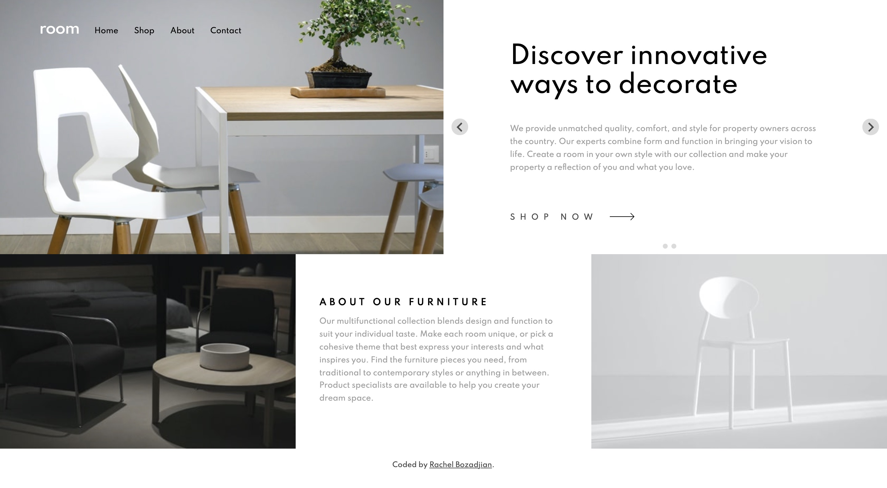

# Furniture Webpage

## Table of contents

- [Overview](#overview)
  - [The challenge](#the-challenge)
  - [Screenshot](#screenshot)
  - [Links](#links)
- [My process](#my-process)
  - [Built with](#built-with)
  - [What I learned](#what-i-learned)
  - [Continued development](#continued-development)
  - [Useful resources](#useful-resources)
- [Author](#author)

## Overview

### The challenge

Users should be able to:

- View the optimal layout for the site depending on their device's screen size
- See hover states for all interactive elements on the page
- Navigate the slider using either their mouse/trackpad or keyboard

### Screenshot

### Links
- [Live Site URL](https://rboz1.github.io/furniture_webpage/#)

## My process

### Built with

- Semantic HTML5 markup
- CSS (Sass/SCSS)
- Flexbox
- CSS Grid
- Mobile-first workflow
- [Splide.js](https://splidejs.com/) - JS Carousel library

### What I learned

I've worked with libraries before in **Python**, but this was one of my first times using a 3rd party library in **JS**. It made me realize yet again how important clear documentation is. It took me a while to understand the documentation and figure out how to get the library set-up and ready to use. The actual utilization part was better documented and fairly simple. 

I also played with creating event listeners in **JS**! I now recognize truly how powerful the ability to manipulate **HTML** via the **DOM** is. I want to explore this more and try to use **JS** instead of **HTML** when I can in the future.

**add code snippet**

### Continued development

I want to understand more about creating modular code in vanilla JS as well as **library import/export**. I love working with libraries now and I want to work with more in the future! I've had my eye on [Anime.js](https://animejs.com/) for a while now.

### Useful resources

- [Adding Event Listeners](https://www.w3schools.com/js/js_htmldom_eventlistener.asp) - Gotta always have a look at W3 schools or MDN when learning new things!
- [Viewport Meta Tag](https://developer.mozilla.org/en-US/docs/Web/HTML/Viewport_meta_tag) - This article explained why I was having issues scaling my site to mobile viewports.

## Author

- Website - [Rachel Bozadjian](https://github.com/rboz1)
